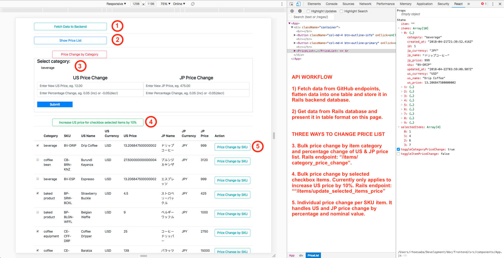

This project is the implementation of BBC Coding Challenge. It is implemented as 2 stand-alone apps:
- [ReactJS Frontend App](https://github.com/swaption2009/bbc/tree/master/frontend)
- [Rails 5 API-only Backend App](https://github.com/swaption2009/bbc/tree/master/backend)

Note: since both React and Rails apps are running on port 3000 by default, please run Rails app on port  3001 to prevent conflict `rails s -p 3001`.

## Table of Contents

- [How to install and run ReactJS frontend app](#install-and-run-react-app)
- [How to install and run Rails backend app](#install-and-run-rails-app)
- [How to use the apps](#how-to-use-apps)
- [React Components](#react-components)
- [Rails Backend](#rails-backend-service)
- [Trade-offs](#trade-offs)
- [Production Readiness](#production-readiness)
- [App Screenshot](#app-screenshot)

## Install and Run React App

* Download from the [source code](https://github.com/swaption2009/bbc/tree/master/frontend)
* `npm install` or `yarn install` to install dependencies.
* `npm start` or `yarn start` to run app on port 3000.

## Install and Run Rails App

* Download from the [source code](https://github.com/swaption2009/bbc/tree/master/backend)
* `bundle install` to install gems
* `rails db:create && rails db:migrate` to prepare database
* `rails s -p 3001` to run app on port 3001

## How-to Use the Apps

1. `Fetch and Populate Data` button will fetch data from GitHub endpoints and populate into our Rails database
2. `Show Price List` button will fetch items data from Rails server and present it on table format.
3. `Price Change by Category` allows users to select a category and apply percentage increase or decrease to change US and JP price within the selected category.
4. `Price Change by SKU` allows users to select an individual item and change the US and JP prices based on percentage change or new nominal values. 
5. `Increase US price for selected checkbox items by 10%` allows users to select a few items by clicking the checkboxes inside items table and automatically increase the US price by 10%.

## React Components

The frontend apps are composed of the following components:

* `App.js` is the app container and entry point of the frontend app.
* `/helpers/API.js` has the functionality to fetch data from GitHub endpoints and populate into Rails backend database.
  * It implements React `componentDidMount()` lifecycle to fetch data from `githubusercontent` endpoints.
  * Once the data has been added, we'll store them in state management.
  * We use `axios` library to send and retrieve data from Rails backend service.
  * `buildItems()` and `categorizeItem()` functions will flatten the different dataset into `item` structure according to our Rails backend API service.
  * `buildStores()` and `buildCategories()` populate data into respective tables.
* `PriceList.js` will fetch data from our database and present it in a table format.
  * We also implement `componentDidMount()` to grab items data from Rails database.
  * Once the data is loaded, we'll store in the state and render the data in table format.
  * It contains a child component `PriceListChange` that is reusable for `Price Change by Category` and `Price Change by SKU` functionality.
* `PriceListChange` is a form to adjust price list.
  * This component is used by `Price Change by Category` and `Price Change by SKU` from it parent component.
  * The parent component will pass different `props` (ie. `category` or `item`) so this component can correctly send the correct action to the backend service.

## Rails Backend Service

* Rails backend service allows CRUD operations to populate `items`, `categories`, and `stores` from our frontend app.
* We simplify our database schema by creating `items` table with the following columns: `category`, `sku`, `us_name`, `us_price`, `us_currency`, `jp_name`, `jp_price`, `jp_currency`.
* To prevent storing duplicated items in the database, we implement uniqueness validations, ie:
  * `item` uniqueness by `sku`,
  * `store` uniqueness by `address`,
  * `category` uniquenes by `name`

## Trade-Offs

* We flatten all item attributes into a flat `items` table (see: Rails Backend Service point no. 2).
  * Pros:
    * It simplfies our API schema and prevents sending and receiving complex nested attributes between frontend and backend services.
    * It helps to speed up our database query by avoiding complex queries using joint tables.
  * Cons:
    * As we open more countries, we'll need to add more columns by a factor of 3 (ie. `name`, `price`, and `currency`).
    * Adding columns will break our API and complicate the deployment.
  * Risk mitigation #1: improve Database Schema to allow more complex queries:
    * follow the same schema from `githubusercontent` endpoints.
    * create separate tables for `items`, `categories`, `stores`, and join table `category_items`
    * `items` has_one `category`
    * `category` has_many `items`
    * `stores` has_many `items` and `categories`
  * Risk mitigation #2:
    * We can take advantage [React Context](https://reactjs.org/docs/context.html) to set multi-language translations using json files, instead of coding translation logics.
    * If using Rails view, we can take advantage of Rails `I18n` to manage static and activerecords translations and `Globalize` gem to create table duplicates to handle items' localized `name` and `price`.
* Using React lifecycle management to fetch and populate data from `githubusercontent` and `Rails database`.
  * Pros:
    * By using `componentDidMount()`, we'll be able to get the data before the main component renders and ensure users will not see null data.
    * It automates fetching data without requiring Users to run a function.
  * Cons:
    * The app will fetch data everytime the component is rendered.
    * If the service fails, the app will not render at all.
  * Risk mitigation:
    * take advantage `Redux Middleware` to handle API calls and use data in `Redux store` to render data on the frontend app.
    * use `cron jobs` backend service to fetch data from outside server. 
  
## Production Readiness

* Security between 2 stand-alone frontend and backend apps
  * `rack-cors` configuration needs to include restricting the original URL and methods.
  * use `token` to authenticate communication between both apps.
  * implement User authentication, eg. Rails `devise` gem.
  
* Validations
  * [frontend] adds form validations to minimize human errors when changing prices.
  * [backend] utilizes Rails ActiveRecord validations to ensure database validity.

* Testings
  * [frontend] uses `jasmine` and `enzyme` to test our React components/
  * [backend] runs `model` and `integration` tests to ensure correct data associations and HTTP response from the frontend app.

* Cron Job
  * Current implementation relies on frontend app to fetch, transform, and populate data. It creates two potential issues:
    * unreliable services make create data discrepancy between our data source and backend database.
    * requires users to run and monitor this functionality.
  * Fetching data from the source should be delegated as backend cron jobs. We can utilize Rails `sidekiq` and `redis` to sync data properly even when there's service disruption.

* Deployment
  * We can deploy one hosting solution to run `frontend`, `backend`, and `database` services or have separate hosting solution for each service.
  

## App Screenshot

